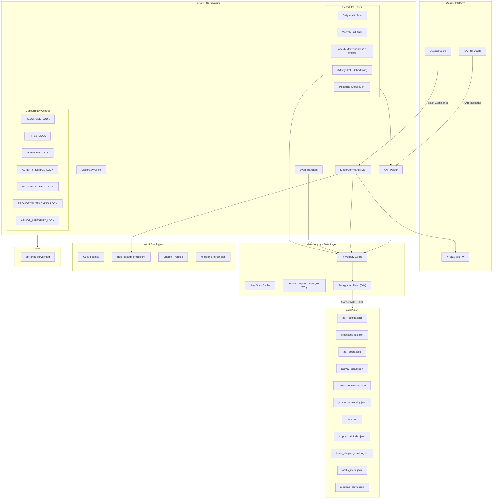

# OP-Scribe Servitor Architecture



## Component Overview

| Component | File | Responsibility |
|-----------|------|----------------|
| Core Engine | `opscribe/bot.py` | Discord client, slash commands, event handlers, scheduled tasks |
| Data Layer | `opscribe/datastore.py` | Write-behind cache, background flush, user stats |
| Constants | `opscribe/constants.py` | Role IDs, channel IDs, file paths, thresholds, mission sets, scheduler defaults |
| Flavor Text | `opscribe/flavor_text.py` | Large RP data tables (chapter blessings, rank acknowledgments, stud milestones, armor/forge phrases, etc.) |
| Permissions | `opscribe/permissions.py` | Battle line / champion / specialist track membership and High Command / Watch Command groups |
| Studs | `opscribe/studs.py` | Pure stud calculation helpers (`_studs_tier`, `_studs_pips`, `_studs_next_target`, `_format_stud_target`, `_get_stud_weight`, `_get_studs_veneration`) |
| AAR Operations | `opscribe/aar_ops.py` | AAR parsing, validation, and reconciliation logic |
| Forge Operations | `opscribe/forge_ops.py` | Forge rite, armor integrity, and blessing system logic |
| Roster Operations | `opscribe/roster_ops.py` | Member tracking, promotions, and activity status logic |
| Entry Point | `run.py` | Simple entry point script that imports and runs the bot |
| Configuration | `config/config.json` | Guild settings, permissions, channel policies |
| Persistence | `data/*.json` | AAR records, activity tracking, milestones, rites |

> **Package structure note:** All bot modules are now organized under the `opscribe/` package.
> The package uses relative imports internally, and external code (tests, scripts) imports
> via `from opscribe.bot import ...`. The `bot.py` module re-exports each extracted module via
> `from <module> import *` so existing references — including the test
> suite's `from bot import X` imports — keep working unchanged. The
> extracted modules contain only pure data and pure functions; runtime
> state (locks, the Discord client, the `DATASTORE` global, mutable
> trackers) remains in `bot.py`.

## Scheduled Tasks

| Task | Interval | Purpose |
|------|----------|---------|
| Daily Audit | 24 hours | Reprocess recent AARs and update archive |
| Monthly Audit | Daily (runs on last day) | Full-history recheck |
| Weekly Maintenance | Hourly (runs on configured day) | Sanctify + full audit |
| Activity Status Check | 4 hours | Check for activity status changes and promotions |
| Milestone Check | Daily (runs weekly) | Check and announce collective milestones to ᛭⋅⋅general-chat⋅⋅᛭ |

## Concurrency Locks

| Lock | Purpose |
|------|---------|
| RECONCILE_LOCK | Prevents concurrent AAR reconciliation |
| RITES_LOCK | Protects rites.json access |
| ROTATION_LOCK | Guards home chapter rotation |
| ACTIVITY_STATUS_LOCK | Protects activity status updates |
| MACHINE_SPIRITS_LOCK | Guards machine spirits data |
| PROMOTION_TRACKING_LOCK | Protects promotion tracking updates |
| ARMOR_INTEGRITY_LOCK | Guards armor integrity data |

## Data Flow

1. **AAR Messages** → Parsed from Discord channels
2. **In-Memory Cache** → Records stored in datastore
3. **Background Flush** → Atomic writes every 60 seconds with `.bak` backups
4. **Slash Commands** → Query cache for real-time reporting

---

## Ordo Xenos Target Packages

**Module:** `opscribe/target_packages_ops.py`  
**Data:** `data/target_packages.json`  
**Reference:** `reference/briefing_templates.json`, `reference/stratagems.json`, `reference/jericho_reach_graph.json`, `reference/operations.json`  
**Config:** `config.json` → `target_packages.highcom_channel_id`

### Overview
Strike packages issued by Ordo Xenos (the bot) for Watch Fortress Jericho to complete. Watch Master requests a batch, reviews ephemerally, and distributes to Captains. Captains assign to Kill Teams. KTs run the op and submit an AAR. Completion/failure adjusts Ordo Xenos standing (-2.0 to +2.0), which controls the stratagem loadout difficulty of future packages.

### Package Lifecycle
```
UNASSIGNED → (WM distributes) → DISTRIBUTED → (Captain assigns KT) →
  AWAITING_SPECIALIST (if specialist required) or ACTIVE →
  (specialist attached) → ACTIVE →
  (KT submits AAR) → COMPLETED
  (deadline passes while assigned) → FAILED
  (deadline passes while distributed, never assigned) → LAPSED
```

### Reputation
- Range: -2.0 to +2.0, float, permanent (never resets)
- Delta per cycle: `(completed - failed) / (completed + failed)`
- Lapsed packages have no rep effect
- Controls pos/neg stratagem ratio in drawn pools:

| Rep | Positive | Negative | Core total |
|-----|----------|----------|------------|
| -2  | 2        | 5        | 7          |
| -1  | 2        | 4        | 6          |
|  0  | 3        | 3        | 6          |
| +1  | 4        | 2        | 6          |
| +2  | 5        | 2        | 7          |

Up to 3 neutral wildcards (`special`/`enemy_modifier` types) drawn alongside core. Intel Lapse auto-injected on Chaos-only maps, not counted.

### Role Requirements
| Tier | Chance | Roles |
|------|--------|-------|
| None (Watch Brother+) | 50% | Anyone active |
| Watch Veteran / Oathsworn | 15% | Watch Veteran, Oathsworn |
| KT command/specialist | 20% | Watch Sergeant, Kill Team Champion, Judiciar |
| Company command/specialist | 10% | Watch Captain, LT, Company Champion, Techmarine, Apothecary, Chaplain, Librarian, Keeper, Honored Dreadnought |
| HC | 5% | Watch Master, Lord Executioner, Forgemaster, Chief Apothecary, High Chaplain, Huntmaster, Void Warden, Castellan, Venerable Dreadnought |

Multi-role requirements allowed at any tier. Only roles with ≥1 active non-Reserves member are eligible for requirement generation.

### Cadre Leaders (specialist assignment authority)
| Cadre Leader | Owns |
|---|---|
| Lord Executioner | Company Champions, Kill Team Champions |
| Forgemaster | Watch Techmarines, Venerable Dreadnought, Honored Dreadnought |
| Chief Apothecary | Watch Apothecaries |
| High Chaplain | Watch Chaplains, Judiciars |
| Void Warden | Watch Librarians |
| Castellan | Watch Keepers |

Cross-company specialist assignment allowed freely within cadre domain.

### Constraints
- KT cap: max 3 packages assigned concurrently
- Assigned members (KT, specialist) locked from other packages until complete/lapsed
- Active filter: Reserves role excluded from all counts and eligibility

### Commands
| Command | Who | Behavior |
|---------|-----|----------|
| `/request_target_packages` | Watch Master | Generate batch → ephemeral paginated board → Distribute All button |
| `/target_packages` | Role-overloaded | WM: full board; Captain/LT: company view; Cadre leader: needs-specialist view; Sgt: KT view |
| `/assign_package` | Captain/LT or Cadre leader | Captain assigns package to KT; Cadre leader attaches specialist |
| `/submit_target_package <id> <aar>` | Any (whitelisted channels) | Submit completion — bot validates mission, roles, submitter |
| `/target_package_status <id>` | WM, Captains, LT, Cadre leaders, KT members (own packages) | Full status of a package |

### Notifications
- WM distributes → highcom channel pings Captains
- Captain assigns KT → bot posts in KT's forum thread
- KT assigned with specialist requirement → highcom channel pings relevant Cadre Leaders

### Tracking
Cumulative all-time stats per Kill Team, Company, and Cadre: `completed`, `failed` (KT/Company); `specialist_attached_completed`, `specialist_attached_failed` (Cadre).

### Background Task
`_tp_expiry_loop` — runs every 30 minutes. Marks overdue assigned packages as FAILED, overdue distributed packages as LAPSED, updates rep.
