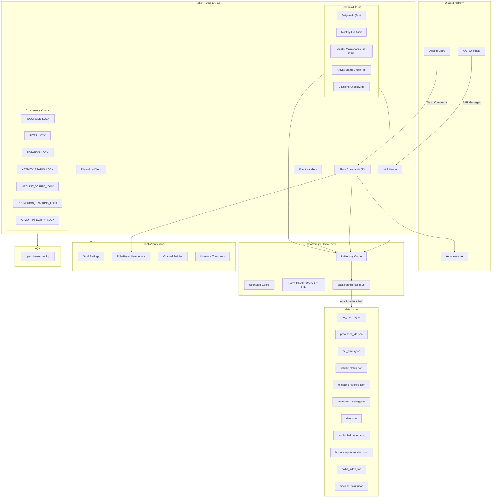

# OP-Scribe Servitor Architecture

## Component Overview

| Component | File | Responsibility |
|-----------|------|----------------|
| Core Engine | `bot.py` | Discord client, slash commands, event handlers, scheduled tasks |
| Data Layer | `datastore.py` | Write-behind cache, background flush, user stats |
| Configuration | `config/config.json` | Guild settings, permissions, channel policies |
| Persistence | `data/*.json` | AAR records, activity tracking, milestones, rites |

## Scheduled Tasks

| Task | Interval | Purpose |
|------|----------|---------|
| Daily Audit | 24 hours | Reprocess recent AARs and update archive |
| Monthly Audit | Daily (runs on last day) | Full-history recheck |
| Weekly Maintenance | Hourly (runs on configured day) | Sanctify + full audit |
| Activity Status Check | 4 hours | Check for activity status changes and promotions |
| Milestone Check | Daily (runs weekly) | Check and announce collective milestones to ᛭⋅⋅general-chat⋅⋅᛭ |

## Concurrency Locks

| Lock | Purpose |
|------|---------|
| RECONCILE_LOCK | Prevents concurrent AAR reconciliation |
| RITES_LOCK | Protects rites.json access |
| ROTATION_LOCK | Guards home chapter rotation |
| ACTIVITY_STATUS_LOCK | Protects activity status updates |
| MACHINE_SPIRITS_LOCK | Guards machine spirits data |
| PROMOTION_TRACKING_LOCK | Protects promotion tracking updates |
| ARMOR_INTEGRITY_LOCK | Guards armor integrity data |

## Data Flow

1. **AAR Messages** → Parsed from Discord channels
2. **In-Memory Cache** → Records stored in datastore
3. **Background Flush** → Atomic writes every 60 seconds with `.bak` backups
4. **Slash Commands** → Query cache for real-time reporting
